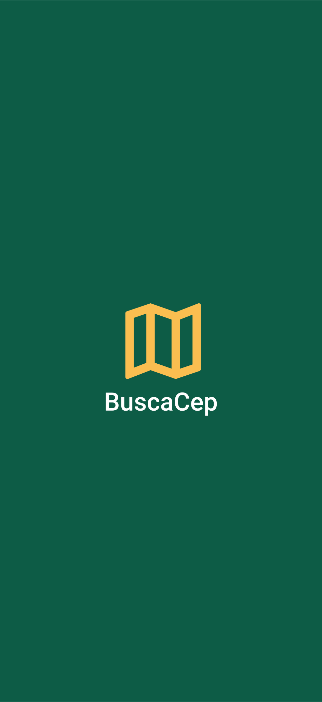

<h1 align="center">
    
</h1>

      
     

**BuscaCep** é uma projeto pessoal criado com react native e typescript utilizando a API do ViaCep para buscar todas as informações do cep e retornar em tela.

# Propósito do Projeto

BuscaCep pode te ajudar se você trabalha com entregas e quer ter informações da localização de seus compradores apenas com o cep.

# Tecnologias

Tecnologias utilizadas no desenvolvimento do projeto:

- [React Native](https://reactnative.dev/)
- [TypeScript](https://www.typescriptlang.org/)
- [Expo](https://expo.io/)
- [Api ViaCep](https://viacep.com.br)

